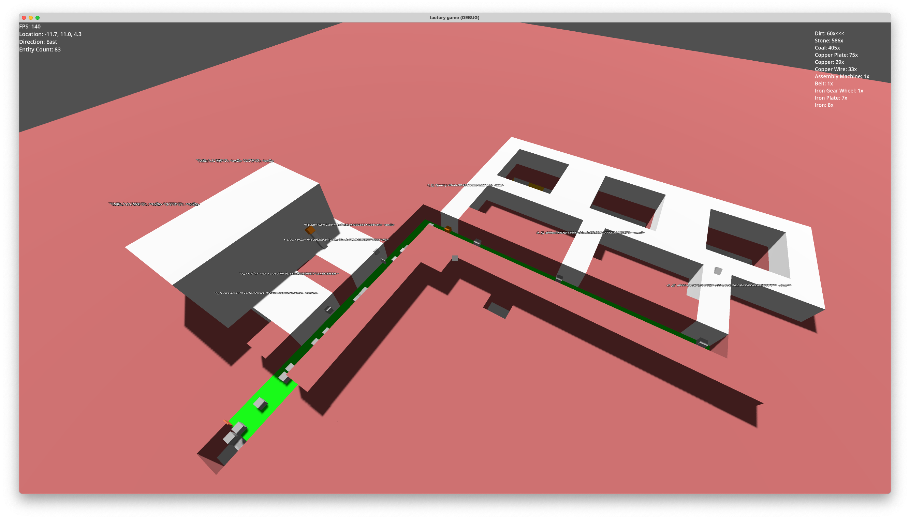
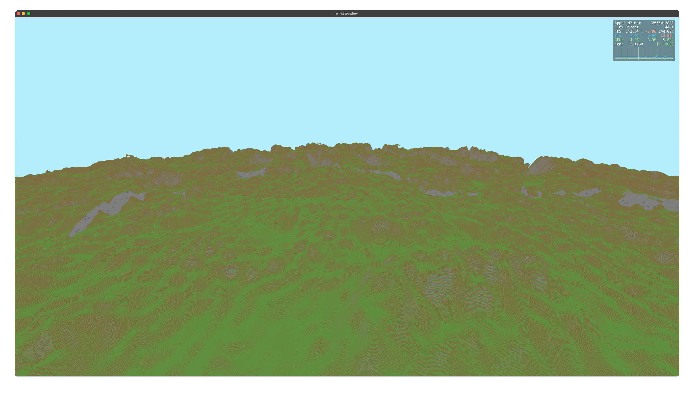

# Godot Ruined My Sense of Speed
Godot didn’t just ruin my game. It ruined how I think about performance and abstraction. What started as a simple voxel prototype spiraled into an existential crisis

It was a sunny day (probably), a few months back. I was in a hotel room on my laptop – the one I definitely bought for studying – playing Factorio, like any good student does.
And then I had a brilliant idea.
An automation game.
Factorio, but bigger! And better!

Did it matter that I had no experience making games?
Don't be ridiculous, of course not!

The plan: mix Factorio’s automation, Terraria’s boss fights, and a Minecraft-esque voxel world.
So I said, considering I have no graphics development experience I should start simple – and make a voxel engine

## The Prototype
> All good games need a prototype  
> \- Sun Tzu


Naturally, the next step was to pick an engine.  
I wanted something fast, simple, cross-platform – and preferably not Unity, because, well, Unity.

Godot seemed perfect. Lightweight, open source, recently got a shiny new 3D renderer (and also because UE hates MacOS)

Of course, I knew GDScript wasn't going to survive a voxel world. So I wrote the simulation in Rust and used Godot purely for visuals.  
Simple plan, what could possibly go wrong?

So I started.  
Made a Rust extension. Drew a quad. Then a cube. Then a whole chunk.  
Suddenly I had mining. Machines. Inserters. Belts. Quarries. Crafting.  

I was unstoppable running purely on caffeine and motivation.  
It might sound like I'm glossing over the implementation, but the entire prototype took literally two days.



I had so many conversations about how the quarry should work with my friends. It was an interesting design problem: finding upgrades for quarries that weren't just "the same thing, but faster", especially since the quarries were meant to dig into the world and destroy it.  

That also turned quarries into a single-pipe problem — where common resources clog the system and starve rarer ones. Totally irrelevant for this prototype though, since items were just physics bodies moving on top of belts.   

Anyways, I was ready. I had spent roughly 32 hours over 2 days working on the first prototype of my life. I went outside to grab some food, came back, and even arranged a play-test for the next day.

Everything was perfect.  
The engine worked. The game ran smoothly – until it didn't.  

### Things go VERY WRONG
Look, I'm lucky enough to have a great computer. During my testing I couldn't even get the game to go below 144FPS.  
But see, I never tried throwing more quarries at it because I assumed any slow-down would come from the naturally expensive thing – the rigidbodies that I used for items.  

In order for this to make sense I need to show you how procedurally generating a chunk goes in Godot.  

A chunk is just a mesh made of triangles made of vertices.
In the simplest voxel engines, you’d generate a quad for every block face — slow, but simple.
For the prototype, I added a very naive culling algorithm so it wouldn’t generate hidden faces.

So far so good. This entire algorithm was implemented in Rust (*blazing fast!*).

Godot exposes a type called [SurfaceTool](https://docs.godotengine.org/en/stable/classes/class_surfacetool.html), which isn't technically the lowest-level API they provide but it is pretty much a drop-in replacement for pushing individual vertices into a list.  

Anyway, here’s how that looked in code – calling into Godot from Rust, in order to draw a quad:

```rust
fn draw_quad(st: &mut SurfaceTool, k: &mut i32, quad: Quad) {
    let normal = match quad.direction {
        ...
    };

    st.set_color(quad.color);
    st.set_normal(normal);
    for corner in quad.corners {
        st.add_vertex(corner);
    }


    st.add_index(*k);
    st.add_index(*k + 1);
    st.add_index(*k + 2);
    st.add_index(*k + 2);
    st.add_index(*k + 3);
    st.add_index(*k);

    *k += 4;
}
```

And here’s what “just pushing to a list” looks like in comparison:

```rust
fn draw_quad(vertices: &mut Vec<Vector3>, indices: &mut Vec<i32>, k: &mut i32, quad: Quad) {
    let normal = match quad.direction {
        ...
    };

    for corner in quad.corners {
        vertices.push(corner);
    }


    indices.push(*k);
    indices.push(*k + 1);
    indices.push(*k + 2);
    indices.push(*k + 2);
    indices.push(*k + 3);
    indices.push(*k);

    *k += 4;
}
```

You might notice there’s not much difference, so really, how bad could [SurfaceTool](https://docs.godotengine.org/en/stable/classes/class_surfacetool.html) be?  

8 milliseconds per chunk! Not terrible – until you realize doing it manually takes 300 microseconds. Twenty-seven times faster.

And that’s not even counting Godot’s mesh conversion time, which I’m pretty sure happens way later.  

At this point you can probably guess what went wrong.
When my friend play-tested the game, the framerate dropped to a cinematic 10 FPS within an hour.

Why didn't I notice it during my own testing?
Simple, I was doing things efficiently. I already knew what to build, nothing went to waste.  
He, on the other hand, decided to cover the planet in quarries (like, five quarries).

After it dropped to 10 FPS, he stopped playing. Which, fair.  
I still count an hour-long playtest as a win – but the reason he stopped playing was... traumatizing.


# The Rebound
The prototype was a success, somewhat.  
So now it was time to make the actual game, properly this time.  

After that Godot fiasco I decided I'd just go pure Rust.

But you can't just start a project, you need an engine!
And it needs to be super performant because I never want to see someone stop playing because of performance again.

Okay, calm down champ.  

After the Godot incident (yes, I'm going to call it that, fight me) I over-corrected hard in the other direction to the point where I was seriously considering making a full-blown game engine.  
Which, granted, isn't entirely out of the question for me... but still, absurdly unnecessary.

Eventually, a brick hit my head and I realized I could just... make a game.
No engine. No framework. Just raw OpenGL and a giant while loop.

Of course you don't need fancy frameworks or giant game engines... You can just make a game.  

At the time, however, this was a big revelation for me.

So I opened up LearnOpenGL and started replicating my Godot voxel engine one-to-one. Which was quite easy, considering I had to do everything manually anyway.  
I had a pretty good voxel engine by this point, it was so much faster than Godot could've ever been, but now I had to actually implement game features.  

The first of many being machines.  

You see in games like Factorio many machines don't need to always run. In fact, they don't! Most machines take in some sort of input, process it for N frames, and then do something as a result of it.  
This sort of system lands itself very well to a WorkQueue.  

Basically, whenever a machine needed to do something again in 20 ticks it would tell the WorkQueue "hmu in 20 ticks" and then the WorkQueue would handle that accordingly.  
This system made sure that even if you had millions of machines only the ones that needed to be updated this tick would be accessed.

Then, came the belts. In Godot I used physics bodies for items on belts because that was the easiest way to do so but it came with a lot of cons the biggest of which being the fact that belts had no throughput limit. Which cuts out basically 80% of the puzzle in automation games.

The tricky part about Factorio-style belts is that they need to be updated back to front, so I had to figure out which belts depend on which other belts – a mini dependency graph!  
Now, after coming from Godot my perception of performance was so ruined that I was incredibly worried that this was going to be a major performance bottleneck if I didn't aggressively cache it.

Luckily for me, I am not skilled enough to be able to write an algorithm that's able to heavily cache it so I decided to settle for just reconstructing the entire graph every frame. And guess what? It never became a performance problem.  

Well that was simple enough, I'll also mention the things that happened after all of that.  
I went on a 3 week journey to optimize the heck out of the voxel engine, during which I switched from OpenGL to WGPU because OpenGL on MacOS does not support Shader Storage Buffer Objects (SSBOs) 

I might make a post on how I optimized the voxel engine ([check out this video by Vercidium](https://www.youtube.com/watch?v=40JzyaOYJeY)) but by the end of it I had a voxel engine with async chunk & mesh generation, running at 144FPS+ on an M2 MacBook using 3 GB of ram with a render distance of 3072 blocks in every direction.




# The conclusion?
I can't say this story has a very good conclusion because the game never ended up getting finished. Mostly because I couldn't figure out a way to make a factory game feel nice to play in a 3D voxel sandbox.  

What I learned from all this wasn’t really about Godot or performance – it was about trust. Or the lack of it.

I thought I was writing about slow code, but looking back, I was really writing about black boxes I couldn’t see inside.

After going cold-turkey on abstractions, I realized something worse than inefficiency: bloat. It turns out working in a simple, honest codebase – one where you see everything – is just more fun.

What's next for the voxel engine? Well, I might remake it in [my programming language](https://github.com/todaymare/margarine). That one also has a great story which I talked about in [this blog post](../four-years-five-failures-one-compiler/)

For those who may want to check out the source code for the final version of the game [here you go](https://github.com/todaymare/factory-game)

Maybe there's a conclusion to draw from this story, in any case I hope you enjoyed it.  